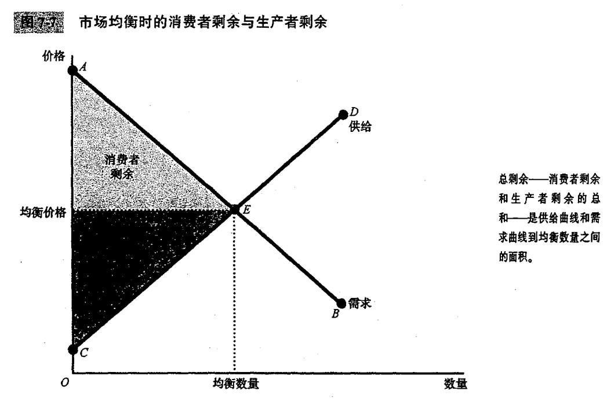

# 第七章 消费者，生产者与市场效率

- **从分析市场配置的实证（是什么）转变为规范（应该是什么）**

### 福利经济学

- 研究资源配置如何影响经济福利的一门学问

- 消费者和生产者在市场价格指导之下的共同行动使其达成了福利最大化的结果

## 消费者剩余

- 买者愿意为一种物品支付的量减去其为此实际支付的量
### 支付意愿

- 买者愿意为某种物品支付的最高量

> 对于价格-需求曲线，需求曲线以下和价格（支付意愿价格）以上的面积衡量市场上的消费者剩余

### 曲线变化

- 价格降低 

- 那些原来以较高价格购买单位物品的买者由于现在支付的少了而状况变好,原有买者的消费者剩余增量是他们减少的支付量，它等于矩形面积 

- 一些新的买者进入市场，因为他们愿意以降低后的价格购买该物品，这些新进入者的消费者剩余是三角形的面积。

- 增加消费者剩余
#### 边际买者

- 如果价格再提高就首先离开市场的买者

>> 在任何一种数量时，需求曲线给出的价格表示边际买者的字符意愿

> **消费者剩余衡量了买者从一种物品中得到的自己感觉到的利益**，一般认为是经济福利的一种好的衡量标准，**在大多数市场上，消费者剩余确实反映了经济福利**

## 生产者剩余

- 卖者出售一种物品得到的量减去其生产成本
### 成本

- 卖者为了生产一种物品而必须放弃的所有东西的价值

> **对于价格-供给曲线，价格以下和供给曲线以上的面积衡量市场上的生产者剩余**

### 曲线

- 价格上升

- 在较低价格时就已经出售单位物品的卖者，由于现在卖到了更高的价格而状况变好，原有卖者的生产者剩余的增加等于矩形的面积。

- 一些新卖者进入市场，因为他们愿意以较高价格生产物品，这些新进入者的生产者剩余是三角形面积。

- 增加消费者剩余

#### 边际卖者

- 如果价格再低就首先离开市场的卖者

>> 在任何一种数量时，供给曲线给出的价格表示边际卖者的成本

> 生产者剩余当然也是一种社会福利的衡量标准

## 市场效率

**如果资源配置可以使总剩余最大化，就说这种配置是有效率的**

- 消费者剩余＝买者的评价－买者支付的量

- 生产者剩余＝卖者得到的量－卖者的成本

- 总剩余＝（买者的评价－买者支付的量）＋（卖者得到的量－卖者的成本）

- **市场的总剩余是用买者支付意愿衡量的买者对物品的总评价减去卖者提供这些物品的总成本**。

### 效率

资源配置使社会所有成员得到的总剩余最大化的性质

### 平等

在社会成员中平均分配经济成果的性质

> 社会计划者想实现社会福利最大化,必须要关心**效率**和**平等**.

### 曲线

- 消费者剩余等于价格以上和需求曲线以下的面积

- 生产者剩余等于价格以下和供给曲线以上的面积。

- 供给曲线和需求曲线到均衡点之间的总面积代表该市场的总剩余。

### 结论

- 自由市场把物品的供给分配给对这些物品评价最高的买者，这种评价用买者的支付意愿来衡量。

- 自由市场将物品的需求分配给能够以最低成本生产这些物品的卖者。

- 在生产量与销售量达到市场均衡时，社会计划者不能通过改善买者之间的消费配置或卖者之间的生产配置来增加经济福利。

- 自由市场生产出使消费者剩余和生产者剩余的总和最大化的物品量。

>>  所以,社会计划者也不可以通过增加或减少物品量来增加总的经济福利

> 市场结果使消费者剩余与生产者剩余之和达到了最大化。

## 结论

- **福利经济学**利用**消费者剩余**与**生产者剩余**这些工具来**评价自由市场的效率**

**自由市场生产出使消费者剩余和生产者剩余的总和最大化的物品量,达到福利最大化**
 整个结论基于以下假设:

- **市场是完全竞争的。**

> 在一些市场上，某个单个买者或卖者可以控制市场价格。这种影响价格的能力被称为**市场势力**,会使市场无效率,使价格和数量背离供求均衡。

- **市场结果只影响参与市场的买者和卖者。**

> 在现实世界中，买者和卖者的决策会影响那些根本不参与市场的人,市场的这种副作用被称为**外部性**，它使市场福利不仅仅取决千买者的评价和卖者的成本,所以从整个社会的角度看，市场均衡可能是无效率的。

### 市场失灵

- 指一些不受管制的市场不能有效地配置资源

> 市场势力和外部性是一种被称为市场失灵的普遍现象的例子,微观经济学家花费许多精力去研究什么时候会发生市场失灵，以及哪种政策能最有效地纠正市场失灵。